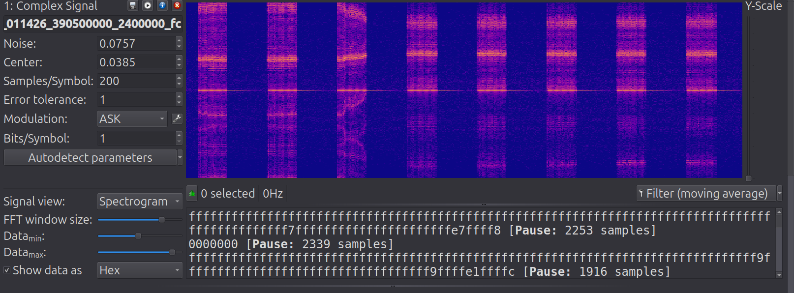
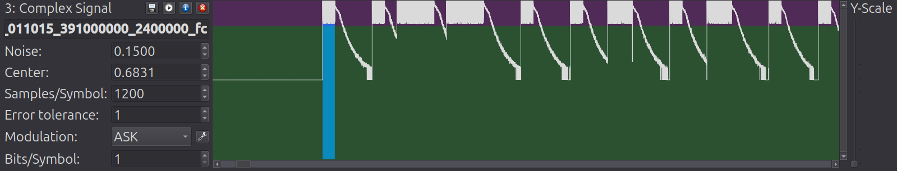
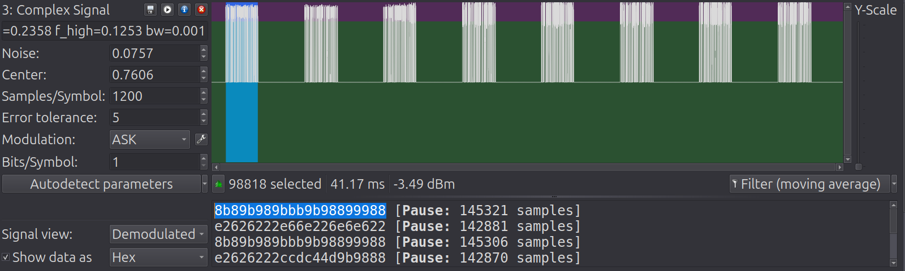
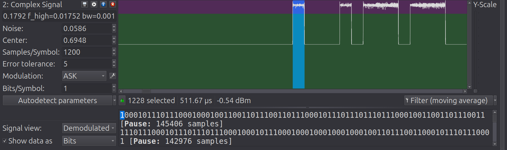
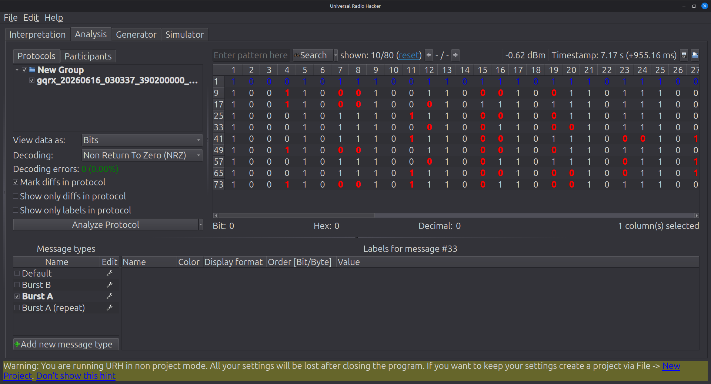
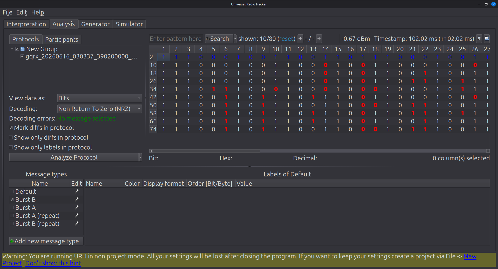

# Introduction/Motivation
I was at home one day when my garage door opened seemingly of its own accord - nobody in our house triggered it. This happened 3 or 4 times that day, and never again. I found this deeply disconcerting. There was no obvious sign of malfunction, and knowing that garage door remotes are notoriously insecure, I wondered how likely it was that someone was driving through my neighborhood with a transmitter to see which garages they could open. Then I wondered if that would even be possible for my system specifically - and decided to investigate and attempt to evaluate how secure my system is. What does the signal look like? Does it have security mechanisms such as a rolling code? How difficult would it be to replicate or spoof the signal?

# The setup

## The hardware

- Nooelec NESDR SMArt RTL-SDR. Its tuning range is 100kHz - 1.75 GHz (advertised).
- Simple telescopic antenna - I'm not optimizing for antenna performance here. Good enough is good enough.
- Craftsman brand remote with FCC ID HBW1255; manufactured in 2002.
## The software
I used gqrx to capture the signals and Universal Radio Hacker (URH) to process them. After demodulation, experiments on the bit strings were done with ad hoc Python scripts.
# Finding the Signal
Various unverified internet sources identified typical garage door operating frequencies between 300 - 400 MHz, varying by year of manufacture. Specific operating frequencies mentioned included 310 MHz, 315 MHz, 390 MHz, and 433 MHz. (Notably, if it's 433 MHz that's in the 70-cm UHF band).  I found the FCC ID and looked at the FCC database on its website. I confirmed that the nominal operating frequency is 390 MHz and note that the authorization was granted in 1997, which hopefully is old enough that the signal will be pretty transparent - many security features such as encryption are more recent protocols, but 1997 is also right about when the first rolling code garage door openers started to be introduced.

I plugged the RTL-SDR (connected to its antenna) into my laptop and opened up `gqrx`. I checked a couple of bands while repeatedly pressing the remote button and saw activity around 390 MHz. It was a bursty signal.

# Modulation and Symbol Rate
Internet sources seem to agree that garage door remotes usually use Amplitude Shift Keying (ASK) or On-Off Keying (OOK). Cost is the primary driving factor behind the choice of modulation here (OOK is very simple, which means cheap receiver hardware), but it's worth noting that since the system is low data rate there is really no need to worry about spectral efficiency, and the noisiness that tends to affect amplitude modulation schemes is not likely to be much of a problem at short range. (Short-range, line-of-sight transmission should have a reasonably high SNR, so the amplitude noise is just not significant.)

I took several recordings of I/Q data: single button presses, multiple button presses in sequence (which will be useful to determine if there's a rolling code), and a continuous button press. The sample rate was set to 2.4M samples per second.

First observations: in the waterfall plot, it looks like the signal is taking up a wider band than I would have expected, enough that at first I wondered if it might really be FSK.
I'm sure that some of this spectral messiness is due to the sharp on/off of the transmitted signal (with no pulse shaping to make the spectrum cleaner; a rectangular pulse in the time domain maps to a sinc pattern in the frequency domain). The rest is hardware artifacts, I think, since there seem to be multiple images of the same thing on the spectrogram.



I'm seeing 8 distinct bursts of activity per button press.

Some questions: what are the bursts? How many symbols per burst?

Here's a zoomed-in look at signal view "demodulation": 
On-Off Keying encodes data by either transmitting a carrier wave or not transmitting. I think within each of the 8 bursts we will find symbols encoded as either on or off. I feel confident identifying this as OOK.

Interestingly, the pulses and gaps between pulses all seem to be approximate multiples of 500 μs (0.5 ms). Therefore, I am going to hypothesize that a symbol is 500 μs long. With a sample rate of 2.4M samples per second and 500 μs per symbol, there should be 1200 samples per symbol. I set the samples/symbol value in URH accordingly. There's a part of me that wonders if these numbers are "too" clean - but it's a simple transmitter so maybe clean numbers are plausible.

With the parameters we have found so far, here is what URH is showing: 

Some good signs:
	1.  One line of bits corresponds to one of the 8 bursts. Mostly that validates that my mental model of this signal is matching what I'm seeing in URH - a good sign since I am still becoming familiar with this tool.
	2.  There are long strings of repeated bits between the first and third bursts and between the second and fourth bursts. That is promising that we will be able to glean some good information about the protocol.

Zooming in further:  
One bit corresponds to one 500 μs chunk - a 1 for each period containing a pulse and a 0 for each period not containing a pulse.

Looks like each button press contains 8 bursts, and the 8 bursts are really two patterns that alternate. So the 1st, 3rd, 5th, and 7th bursts are identical (pattern "A", length 81 bits), and the 2nd, 4th, 6th, and 8th bursts are also identical (pattern "B", length 83 bits). Patterns A and B change slightly between button presses - a good thing to investigate next, as it suggests the presence of a rolling code. One notable pattern that is NOT present - there are no strings of 0s or 1s that are longer than 3 bits. This is interesting because of a patent I found by Chamberlain (a common maker of garage door openers). The patent application was submitted in 1997 in the US, and says in part:

> A rolling code transmitter is useful in a security system for providing secure encrypted RF transmission comprising an interleaved *trinary* bit fixed code and rolling code. (emphasis mine)

The patent application goes on to talk about using fixed-width pulses for 0, 1, and 2. This could be the same thing I'm seeing (the brand is Craftsman, but apparently Chamberlain has manufactured Craftsman garage door openers for many years under a licensing agreement).

More from the patent application:
> wherein a first of the different configurations is represented by a first amplitude radio frequency signal having a length of about 0.5 milliseconds followed by a second amplitude radio frequency signal having a length of about 1.5 milliseconds,

> wherein a second of the different configurations is represented by a first amplitude radio frequency signal having a length of about 1.0 milliseconds followed by a second amplitude radio frequency signal having a length of about 1.0 milliseconds,

> wherein a third of the different configurations is represented by a first amplitude radio frequency signal having a length of about 1.5 milliseconds followed by a second amplitude radio frequency signal having a length of about 0.5 milliseconds.

Looks like my 500 μs symbol length conjecture was probably correct!

The patent application may have more clues, but we'll continue our investigation independently for now.

# Initial Bit Analysis
I now look closer at the actual bits that have been decoded. Each burst is a sequence of bits, and there are two sequences per button press alternating in an A/B pattern, like this:
```
(A) 8bb8899b9b8bbbb899b98
(B) ee2eee22e222226e62ee2
(A) 8bb8899b9b8bbbb899b98
(B) ee2eee22e222226e62ee2
(A) 8bb8899b9b8bbbb899b98
(B) ee2eee22e222226e62ee2
(A) 8bb8899b9b8bbbb899b98
(B) ee2eee22e222226e62ee2
```

```
(A) 9898b8bb9b8b9999898b8
(B) ee266ee6eeee62e66622e
(A) 9898b8bb9b8b9999898b8
(B) ee266ee6eeee62e66622e
(A) 9898b8bb9b8b9999898b8
(B) ee266ee6eeee62e66622e
(A) 9898b8bb9b8b9999898b8
(B) ee266ee6eeee62e66622e
```

The sequences in the two button presses look similar, but not identical. My understanding is that rolling codes in these types of systems are provided by pseudo random number generators. But from looking at the hex codes, my first reaction is that they look too similar. On the other hand, I remember the earlier language about ternary symbols. Perhaps there are fewer possible symbols and my intuition was assuming we could see any combination of bits. Maybe it would be good to group the bits in groups of 3 rather than 4 and see if that clears things up.

The same two button presses in 3 bit (octal) representation:
```
(A) 427342114671561356734231563
(B) 7342735610561042104671427341
(A) 427342114671561356734231563
(B) 7342735610561042104671427341
(A) 427342114671561356734231563
(B) 7342735610561042104671427341
(A) 427342114671561356734231563
(B) 7342735610561042104671427341
```

```
(A) 461142705671561346314611427
(B) 7342315671567356305631461053
(A) 461142705671561346314611427
(B) 7342315671567356305631461053
(A) 461142705671561346314611427
(B) 7342315671567356305631461053
(A) 461142705671561346314611427
(B) 7342315671567356305631461053
```

Hmm...same pattern, it's not any clearer.
Another approach I may take is running correlations between the strings from different button presses - I could have essentially the same thing for a lot of the sequence but not be able to tell if the bits are offset a little bit. I could also take a look at the recording I made of one continuous button press, which should give me lots of examples to compare.


It could also be that the symbol alphabet is smaller than I would have thought, so I'm seeing a lot of repetition in the hex strings which gives the illusion that they are more similar. I wonder if a symbol alphabet is something I can infer and if so how? My inclination is leaning toward 3 bits per symbol, but I don't know how sound that is. That is: each symbol is comprised of 3 bits, but the alphabet is constrained so only certain three bit patterns are possible. The reason I think this is both because of the power of suggestion from the ternary symbols mentioned in the patent application - not everything in that application is likely directly applicable to my device, but there are likely some similarities - and because when you look at the raw bits, there are never more than 3 consecutive 0s or 3 consecutive 1s, which could mean the symbol alphabet doesn't include 4-bit symbols. (Not a foolproof hypothesis - I guess we could have 4 bit symbols but 0000 and 1111 in particular don't happen to be valid symbols).

Here's the configurations/processing I did in URH to get the bits:
 - verify noise threshold (the default ended up being pretty good)
 - set samples/symbol to 1200
 - set modulation to ASK, 1 bit per symbol
 - apply bandpass filter
 - adjust decision threshold

 The passband was from a normalized low frequency of 0.01752 and a normalized high frequency of 0.1792. With a sample rate of 2.4 MSPS the band is from 42 kHz - 430 kHz above the center frequency of 390.5 MHz. The passband width is then approximately 388 kHz. I used a "filter bandwidth" (as URH calls it) of .001 (very narrow - 4001 filter taps). When I selected the range to filter I tried to visually center it on the apparent operating frequency (the highest power part of the spectrum), and tried to capture most of the nearby power without including any IQ images or the DC spike (both hardware artifacts). This was quick and dirty, but given the messiness of the spectrum due to the hardware, it didn't make a lot of sense to spend too much time trying to perfectly determine the exact frequency and bandwidth. Luckily we are working with OOK which is effectively a digital signal - it's easy to set the bit decision threshold and a little bit of noisiness really isn't much of an issue.

Looking at the long press: I just held down the button and recorded the signal. The bits were these two lines repeated 19 times each:
```
(A) 98b98bb9999b99999bbb8
(B) ee266ee6e2222266226ee
(A) 98b98bb9999b99999bbb8
(B) ee266ee6e2222266226ee
(A) .....
(B) ..... etc
```

This has none of the variation we were seeing on the separate presses. That's mysterious to me. Maybe it couldn't get through its transmission because I was holding the button down, and so it just kept restarting? Different presses had slightly different strings in my other tests, so this is very strange.

# Protocol Structure
First I recorded a new dataset with 10 presses — I needed more bits to work with. I combined these with the other previously recorded presses for a total of 15. I noticed that each press followed the same A/B/A/B pattern, and there were no repeated burst strings between presses. That suggested some sort of rolling code, although it's not immediately clear where in the protocol that shows up, because the bursts are not consistently starting with the same strings.

Visual inspection shows that the bits definitely come from a constrained alphabet. In hex, only the symbols 0x8, 0x9, 0xb, and sometimes 1 show up on the "A" pattern. Only 0x2, 0x6, and 0xe show up on the "B" pattern.
I computed the entropy of the bits using different symbol lengths (number of bits grouped together). The entropy for 4 bit symbols is notably lower than the entropy for 2, 3, or 5 bits. The entropy starts to dip again around 8-bit symbols, although I suspect it will be harder to be confident in our results at longer symbols because our data is limited. Each burst has roughly 80 bits, so at longer symbol lengths fewer possible symbols will occur, and the entropy is just going to go down. I do at least feel better inferring a symbol length of 4 bits than 3 or 5.

Next approach: finding longest common substring. I used the pylcs library to do this and considered A bursts and B bursts separately. The findings:
```
Common substring of all A bursts: 10001011100110 length: 14
Common substring of all B bursts: 1001100010 length: 10
```
Those certainly seem long enough to potentially be synchronization words, but they do not consistently appear in the same place in each burst. Unfortunately, this approach was a dead end.

However, when I grouped the A bursts and B bursts together and removed duplicates, I could see that:
- All A bursts begin with '100'
- All B bursts begin with '1110'

I'm starting to identify a pattern in the A bursts:

This image shows a single A burst from each of the 10 presses (duplicates are hidden).
The first three bits of an A burst are '100'. The fourth bit varies. Then we see a pattern: two bits equal to '10' followed by two varying bits, and so on, the pattern repeating through the burst. The final bit, bit 81, is always '1'. So an A burst looks like this: `100X 10XX 10XX .... 10XX 1`


The same alternating symbol pattern is happening in the B bursts as well: `11 10XX 10XX 10XX .... 10XX 1`

I extract the varying bits and count the symbols:
```
Varying bits (2-bit symbols):
  A counts: {'00': 60, '01': 53, '10': 0, '11': 77}
  B counts: {'00': 66, '01': 71, '10': 0, '11': 63}
```
(This is excluding the varying bit 4 in the A bursts)

The lack of '10' symbols in the varying bits shows us definitively that we do have a ternary alphabet consisting of symbols 1000, 1001, and 1011 -- just as was suggested by the patent application.  This wasn't immediately visible because the relevant symbols start at bit 5 on the A bursts and at bit 3 on the B bursts, so they don't align perfectly when looking at the hex strings. However, if you omit the first two '11' bits on the B bursts and look at the hex strings, they consist of 8, 9, and B - just like the A bursts. '10' occurs only as the "header" bits of the symbols, perhaps to help the receiver stay in sync.

At one point in processing the bits, I came across a single anomalous burst, a B-burst that was one bit shorter than the rest and didn't match the other B-bursts in that transmission.  It was obviously different, containing hex values that didn't appear anywhere else. This was fixed by adjusting the bit decision threshold in URH. To me this suggests that the A/B repetition (transmitting each burst 4 times) is a safety factor, so if there is noisiness in one of the bursts and the receiver gets invalid symbols, it can just discard that burst and use one of the duplicates. Since the system is short-range and line-of-sight, and OOK approximates a digital signal, this shouldn't happen too often; it should be pretty resilient to noise. But it is bound to happen sometimes, and the A/B pattern looks like a built-in protection against the occasional bit flip due to noise.

I speculated that bit 4 in the A bursts may be a checksum bit, but that doesn't seem to be the case; I summed together the varying bits mod 2 and didn't find evidence that bit 4 was used as a straightforward parity bit.

Beyond that, it is unclear which of the changing bits belong to payload and which may belong to a CRC block or checksum.

# Commentary

An interesting consequence of this process has been discovering different packet structures than I had come across in the past. I was somewhat expecting clear demarcations between header, payload, and checksum. Instead the payload is interleaved with known symbols. It is reasonable enough, but was a point of learning for me that will give me a broader view of what a packet structure might look like next time I am examining an unknown protocol.

The observation about the A/B/A/B pattern was essential, but the turning point in making sense of the packet structure came from removing duplicate strings and looking at the A burst messages and B burst messages separately and noticing that they always started with the same bits. Then the structure quickly became clear: a short prefix at the beginning of the burst, followed by four bit symbols starting with '10'. This is clearly a ternary alphabet consisting of '1000' (0x8), '1001' (0x9), and '1011' (0xb).

I thought more information about the signal, such as the presence or absence of a checksum or CRC, could probably be inferred, either by looking closer into the patent documentation or by a brute-force approach to test a variety of CRC lengths. In fact, when I looked closer at the patent documentation there was no CRC or checksum mentioned at all. It sounds like it relies on the repetition of the bits and particularly the `10` at the beginning of each symbol to make sure the receiver stays in sync with the transmission. From what I've gathered explicit error detection in the form of a checksum or CRC is very common and maybe even expected, so this is surprising - but if it had been present, maybe we would expect it to be more visible in the protocol structure.

Another discrepancy was that the patent application described the transmission of two frames with 40 symbols each. Across my 15 recorded transmissions I identified 79 varying bit fields. 40 symbols would cleanly map to 80 varying bit fields (using the ternary alphabet we identified earlier), and I don't have an explanation why this doesn't match up. It's possible that the actual implementation differed slightly from what was described in the patent, and it's worth noting that my device was a Craftsman, not a Chamberlain as mentioned before. It is very unlikely that an actual varying bit field would have randomly produced the same bit in all 15 transmissions (a probability of 1/2^14 I believe), but technically not impossible. I have been unable to determine the reason for the difference here.

# Conclusion

The presence of the rolling code I observed makes me more confident in the overall security of the garage door opener. Earlier implementations did not have features like this, which made it relatively easy to drive around the neighborhood with a transmitter to see which doors you could trigger. This alone makes a malicious actor a much less probable explanation for my garage door's strange behavior. The Chamberlain patent application, which describes a similar system if not the exact model I've been experimenting with, enumerates further protections at the receiver side: for example, if the rolling code counter in the remote is much further ahead than the receiver expects, it requires two consecutive correct transmissions to respond.

Newer systems have even more protections in place. This older system is probably still vulnerable to attacks such as the famous RollJam attack (Samy Kamkar, DEF CON 23) which worked by jamming the signal to prevent it from reaching the receiver and simultaneously recording the transmission in order to get a valid code to use later. In the end, I conclude that while not unbreakable, the system is likely secure enough for most of us - but it may be wise to store important valuables (precious metals, limited-edition beanie babies, rings of power) in a more secure location.

**AI disclosure**: generative AI was used to proofread this document for spelling errors and correct grammar, and to assist in formatting the final document. All of the research and writing was done by me.
